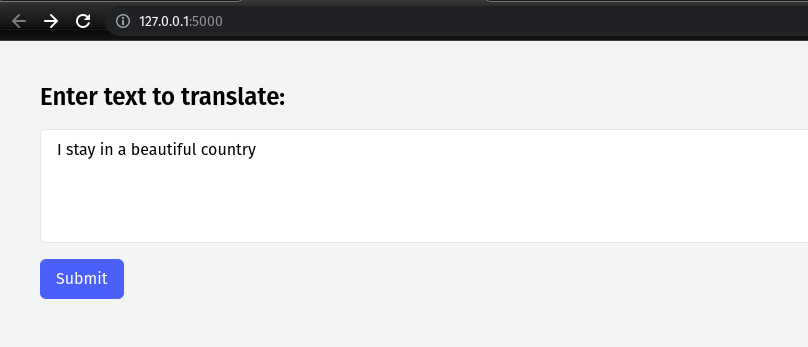
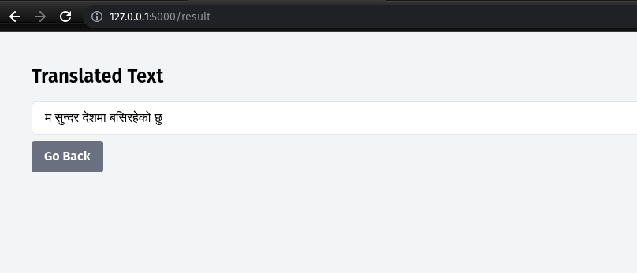

# eng-to-nep-translation

This project fine tunes the pre-trained model [facebook/nllb-200-distilled-600M](https://huggingface.co/facebook/nllb-200-distilled-600M) using the english to nepali translation dataset [CohleM/english-to-nepali](https://huggingface.co/datasets/CohleM/english-to-nepali).
The notebook english-to-nepali.ipynb provides the script written for finetuning the base model on our dataset

## Project Demo
[https://youtu.be/QlrjCM2o0FI](https://youtu.be/QlrjCM2o0FI)

## Trying out the project
To try the project follow the following steps :
1. Create a virtual environment
``` python -m venv venv ```
2. Activate the environment
```source ./venv/bin/activate ```
3. Install the dependencies
```pip install -r requirements.txt ```
4. Run the app
```python app.py ```

## Output



#### Team Members
- Rujen Gelal
- Santosh Pandey
- Shishir Bhandari

